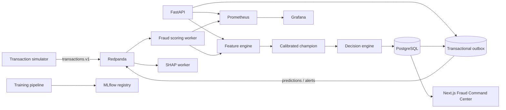

# Real-Time Fraud Detection Platform

A production-style portfolio system that turns payment events into calibrated fraud probabilities,
business decisions, alerts, delayed-label metrics, drift reports, and operational dashboards. This is
an engineered application—not a notebook classifier—and deliberately separates model risk from the
policy that approves, reviews, or blocks a payment.

## Why this project exists

Fraud detection is a useful intersection of machine learning, streaming, backend design, data
engineering, MLOps, and business decision-making. This repository demonstrates those disciplines in
one locally reproducible system while being honest about its synthetic data and single-machine scale.



## Implemented capabilities

- FastAPI scoring with strict Pydantic contracts, OpenAPI docs, health checks, idempotent transaction
  IDs, and a normalized SQLAlchemy/PostgreSQL data model.
- Redpanda topics for transactions, predictions, alerts, confirmed labels, and dead-letter events;
  manual offset commits and a transactional outbox prevent database/event divergence.
- Point-in-time amount, behavioral, velocity, novelty, IP, and geographic features. Every online
  history query excludes the current and future events.
- Logistic Regression, random undersampling, and SMOTE baselines plus Optuna-tuned Random Forest and
  XGBoost with chronological splits, calibration, business-cost thresholding, nested MLflow runs,
  lineage metadata, and guarded champion/challenger aliases.
- Separate risk score and decision policy with configurable review/block thresholds and escalation
  rules for bursts, anomalous amounts, new devices, and impossible travel.
- Asynchronous SHAP explanations for alerts, a transparent reason-code fallback, delayed confirmed
  labels, PSI/KS/Jensen–Shannon drift checks, and champion/challenger promotion gates.
- Two-window segment drift and 200-label delayed-performance triggers create idempotent retraining
  jobs; passing challengers still require explicit, audited manual promotion.
- Next.js/TypeScript Fraud Command Center plus Prometheus/Grafana system telemetry.
- A filterable authorization feed and same-page investigation workspace with immutable point-in-time
  feature snapshots, user history, reason codes/SHAP factors, and lightweight analyst case resolution.
- Alembic migrations, structured JSON logs, Docker Compose, pytest, Ruff, mypy configuration, and a
  real Locust workload.

## Measured demo model results

These values come from `artifacts/challenger_model_report.json`, generated locally on 2026-08-26 UTC. The demo used a
deterministic 249,992-row sample distributed across the full Fraud Detection Handbook timeline. The
latest 15% was untouched until final evaluation.

| Metric | Held-out result |
|---|---:|
| Selected challenger | Random Forest |
| Precision | 0.9266 |
| Recall | 0.3108 |
| F1 | 0.4654 |
| PR-AUC | 0.3363 |
| ROC-AUC | 0.6677 |
| False-positive rate | 0.000215 |
| False-negative rate | 0.6892 |
| Review / block thresholds | 0.15 / 0.40 |

Accuracy is intentionally not a selection metric: a model predicting “legitimate” for nearly every
payment can have excellent accuracy and still miss the fraud class. The champion was selected by
validation-period expected business cost, with PR-AUC as a tie-breaker. The reported cost value is a
configured simulation objective, not claimed financial savings.

## Data and leakage controls

The core source is the open [Fraud Detection Handbook simulated dataset](https://fraud-detection-handbook.github.io/fraud-detection-handbook/Chapter_3_GettingStarted/SimulatedDataset.html).
It contains chronological customer/terminal/amount events and time-dependent fraud scenarios. The
download script records the observed archive SHA-256.

Deterministic enrichment adds operational fields needed by the live event contract. Country/device
takeover context is label-conditioned synthetic behavior and is therefore **excluded from model
features**; it is used only to exercise explicit online rules and dashboards. `TX_FRAUD_SCENARIO`, the
target, and future aggregates are never model inputs; shared feature contracts and leakage tests enforce
these exclusions.

## Run locally

### Docker Compose

Docker Desktop is required. The Compose topology has been verified locally, including first-run data
preparation, model training and registration, application migrations, and service health checks.

```bash
cp .env.example .env
docker compose up --build
```

The first start downloads the public data, creates a distributed demo sample, trains/registers the
model, applies migrations, and starts the services. Cached named volumes make later starts faster.
MLflow keeps its metadata database beside its registry artifacts in the persistent
`model_artifacts` volume, isolating its internal migrations from the application's PostgreSQL schema.

| Service | URL |
|---|---|
| API | http://localhost:8000 |
| Swagger | http://localhost:8000/docs |
| Fraud Command Center | http://localhost:8501 |
| MLflow | http://localhost:5000 |
| Prometheus | http://localhost:9090 |
| Grafana | http://localhost:3000 |

Use `docker compose --profile full up --build` to expose Redpanda Console and run the full-dataset
training job. This is substantially heavier than the demo profile.

### Native development

```bash
python -m venv .venv
.venv/Scripts/pip install -e ".[ml,streaming,dashboard,dev]"
python -m scripts.bootstrap
uvicorn apps.api.main:app --reload
```

Run the worker, simulator, explainer, monitor, and dashboard in separate terminals. PostgreSQL and
Redpanda connection settings come from `.env`.

## API example

```bash
curl -X POST http://localhost:8000/transactions \
  -H "Content-Type: application/json" \
  -d '{
    "transaction_id":"txn-123","user_id":"user-883","merchant_id":"merchant-124",
    "timestamp":"2026-08-10T18:43:21Z","amount":149.95,"currency":"USD",
    "merchant_category":"electronics","country":"US","device_id":"device-992",
    "ip_address":"192.0.2.10","channel":"web"
  }'
```

Important endpoints include the filterable `GET /transactions` feed,
`/transactions/{id}/investigation`, `/transactions/{id}`, `/predictions/{id}`,
`/predictions/{id}/explanation`, `/alerts`, `PATCH /alerts/{id}` analyst workflow,
`/transactions/{id}/label`, `/model/info`, `/analytics/model-performance`, `/health/ready`, and
`/metrics`.

In the Fraud Command Center, select a transaction row to inspect its authorization-time behavior,
model decision, triggered rules, explanation, and earlier user activity. Review/block alerts can be
moved into review and resolved as fraud or legitimate; resolution atomically writes the delayed label
used by performance monitoring.

## Testing and benchmarks

```powershell
./scripts/verify.ps1 -Integration -Frontend
```

The 2026-08-27 Phase 6 core acceptance run passed 33 backend unit/contract tests, 2 real-infrastructure
Testcontainers tests (PostgreSQL and Redpanda), and 2 Playwright analyst-flow tests. Ruff, strict mypy,
ESLint, TypeScript, both production image builds, and a clean-volume Compose bootstrap also passed.
The complete 10/50/100-user and streaming benchmark matrix has not yet been published; latency and
throughput therefore remain **Not measured**. Never copy the target p95 under 100 ms into a CV as if it
were a result. The V1 release gate therefore remains conditional on publishing that matrix.

## Repository map

```text
apps/                 API, workers, simulator, Next.js dashboard
src/fraud_detection/ Shared domain, feature, model, decision, DB, streaming, monitoring code
pipelines/            Data preparation, training, evaluation, retraining
alembic/              Database migrations
configs/              Auditable policy/cost defaults
docker/               Prometheus and Grafana provisioning
tests/                Unit, API, ML, drift, and lifecycle tests
docs/                 Architecture, modeling, ADRs, interview and portfolio material
```

## Limitations and future improvements

This is a local portfolio platform using synthetic data. It has no authentication, PCI controls,
real payment integration, Redis/online feature store, Kubernetes deployment, managed secrets, schema
registry, or measured high-throughput claim. The demo’s uniformly sampled timeline approximates
rolling activity; full-data training is required for authoritative velocity evaluation.
