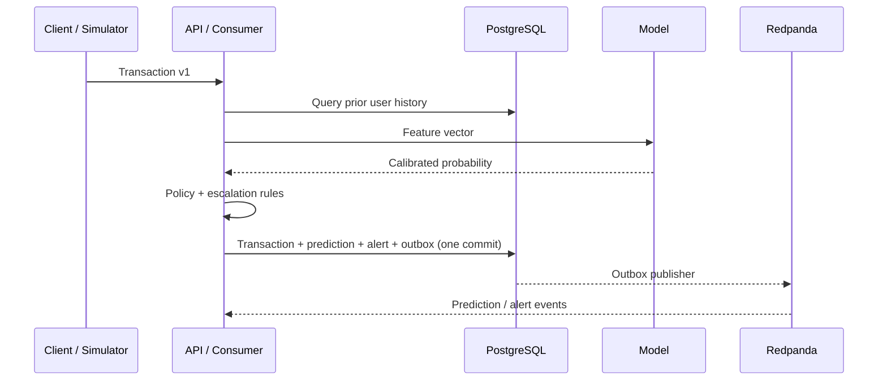

# Architecture

## Component boundaries

The API and streaming worker call the same `ScoringService`; this prevents two implementations of
authorization logic. The service asks a `HistoryProvider` for prior events, creates point-in-time
features, calls a probability model, and delegates the final action to `DecisionEngine`.

### FastAPI

Provides the low-latency synchronous contract expected by a payment authorization caller. A repeated
transaction ID returns the stored prediction rather than producing duplicate records. OpenAPI,
Pydantic validation, readiness, liveness, analytics, labels, and Prometheus are part of this boundary.

### Redpanda and workers

Redpanda implements Kafka semantics with a lighter local footprint. The simulator publishes
`transactions.v1`; the scoring consumer commits an offset only after the database transaction commits.
Malformed events go to `transactions.dlq.v1`. The outbox publisher can duplicate an event after a
crash between Kafka acknowledgement and `published_at`; consumers are intentionally idempotent.

### PostgreSQL

PostgreSQL is the system of record and local history store. Normalized records cover users, merchants,
transactions, predictions, alerts, confirmed labels, outbox events, model versions, and drift reports.
The `(user_id, timestamp)` index supports rolling history lookup. SQLite is available only as a test/
developer fallback.

### Model lifecycle

Training is a separate process. It writes a versioned joblib bundle containing the calibrated pipeline,
feature order, optimized thresholds, SHAP background, and reference distributions. MLflow stores runs
and registers `fraud-detector`. Retraining writes a challenger and a promotion recommendation; it never
automatically replaces the champion.

## Failure behavior

- **PostgreSQL unavailable:** readiness fails and scoring cannot commit. The caller receives failure;
  the system does not emit an unpersisted decision.
- **Redpanda unavailable:** synchronous API scoring still commits with an outbox row. Publishing retries
  after recovery. Simulator ingestion pauses at the broker.
- **Model artifact absent:** a conspicuously named bootstrap heuristic keeps development endpoints usable;
  `/model/info` exposes this state. It must not be described as the trained champion.
- **Consumer crash:** uncommitted messages replay. Transaction IDs make the scoring operation idempotent.
- **SHAP failure:** authorization is unaffected because explanation generation is asynchronous.

## Scaling boundary

The implemented SQL history lookup and single-process workers are correct for a local demonstration,
not massive traffic. Production would partition Kafka by user ID, scale consumer groups, serve the model
behind horizontally scalable instances, use Redis or a managed feature store for atomic rolling state,
split analytical and transactional storage, and run under Kubernetes with autoscaling and distributed
tracing.
